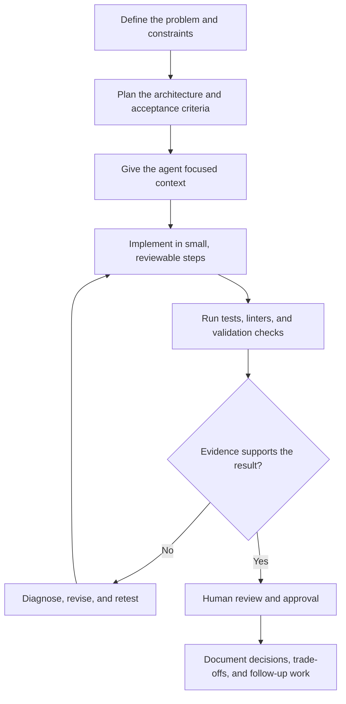

# Agentic Development Workflow

This workflow describes how I use AI agents as engineering collaborators while keeping human direction, deterministic execution, and verification at the center.

## Workflow



## Core principles

1. **Human-directed** — I define the goal, constraints, priorities, and final acceptance criteria.
2. **Context-first** — The agent receives the relevant requirements, repository structure, interfaces, conventions, and known risks before implementation begins.
3. **Small changes** — Work is decomposed into focused tasks that are easier to inspect, test, and revert.
4. **Reasoning separated from execution** — AI is used for analysis, planning, and generation; deterministic tools perform builds, tests, formatting, and deployment checks.
5. **Verification gates** — No result is accepted solely because it sounds plausible. Tests, static checks, runtime behavior, and review provide evidence.
6. **Traceable decisions** — Important assumptions, failures, trade-offs, and improvements are recorded for future iterations.

## Agent roles

- **Planner:** clarifies requirements, identifies dependencies, and proposes an implementation plan.
- **Builder:** produces the smallest implementation that satisfies the agreed criteria.
- **Verifier:** checks tests, edge cases, security concerns, regressions, and consistency with the repository.
- **Reviewer:** challenges assumptions and confirms that the result is understandable and maintainable.

These roles can be performed by one model or several agents, but the boundaries remain explicit so that generation is not mistaken for verification.

## Practical loop

```text
Understand → Plan → Implement → Test → Inspect evidence → Review → Document
                    ↑                 │
                    └── Revise ──────┘
```

For each task I aim to produce:

- a clear problem statement;
- explicit acceptance criteria;
- a minimal, reviewable change;
- reproducible validation results; and
- a short record of what worked, what failed, and what should improve next.

> AI accelerates development, but engineering quality comes from clear context, deterministic checks, and accountable human review.
